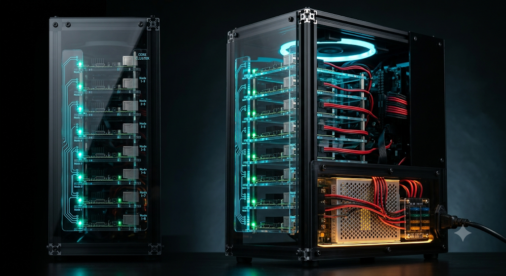

# Aries 28

**A tower-format mini private data center — a Raspberry Pi cluster that is a self-hosted private cloud, a k3s learning platform, and a documented hardware build, in one buildable box.**



> *Concept render (AI-generated) shown as the design target. To be replaced with a staged photograph of the real build.*

Aries 28 is an open hardware + software project: a **mini private data center** in a desktop tower — a cluster of Raspberry Pi boards running a real Kubernetes (k3s) cluster with distributed storage, housed in a laser-cut / 3D-printed / CNC enclosure. It has, in miniature, what a real data center has: redundant compute, a fused power-distribution system, managed cooling and airflow, structured network cabling, and a facilities layer (gateway, monitoring, orderly power sequencing). It is designed to be **replicated, understood, and modified** — every mechanical part, wiring decision, and cluster-setup step is documented, and the fabrication files are first-class artifacts alongside the code. An optional lighting layer is included for those who want it, but the enclosure and its illumination are presentation, not requirements.

It is deliberately *not* a performance machine. It is a machine for **learning** — Kubernetes control-plane redundancy, distributed storage, networking, power distribution, and physical fabrication — and a documented, hand-built piece of hardware. It provides node-level fault tolerance within the cluster; it is a single tower with acknowledged single points of failure (see the design doc), not a highly-available production system.

> **Status:** Active build. Documentation and design files are ahead of the physical build in places — treat this as a living project, not a finished kit.

---

## What it is

- **A mini data center:** redundant compute, fused power distribution, managed cooling, and structured cabling — the concerns of a real facility, at hobby scale, which is much of what makes it educational.
- **A cluster:** one or more single-board computers running k3s (lightweight Kubernetes) — starting from a single working node and scaling out with no fixed limit as boards are added. Added nodes become workers that expand the cluster's compute capacity; control-plane redundancy (HA with embedded etcd) is available along the way, but the cluster's growth is about overall capacity, not a fixed topology.
- **A private cloud:** distributed block storage and self-hosted apps, with an offline-capable design (self-hosted container registry, no external dependencies after setup).
- **An enclosure (optional aesthetic):** a black anodized 2020 aluminum-extrusion frame with acrylic panels, an exposed and serviceable power bay, and an optional lighting layer — including a status-lighting system that can reflect live cluster state. The styling is one implementation's choice, not a requirement.
- **A curriculum:** the build teaches control-plane quorum, distributed storage, routing/VLANs, infrastructure-as-code, power/fusing, and mechanical design — each embedded in a working part of the machine.

## What makes it different

Most Pi-cluster projects publish either the software (k3s scripts) *or* a case STL. Aries 28 aims to publish the **complete package**: mechanical design (STL / SVG / CAD), power and electrical design, cluster setup runbooks, and the reasoning behind each decision — so someone can replicate the whole thing or fork any layer of it.

The enclosure treats things other builds hide as **features**: the power supply and its wiring are on display behind smoked acrylic, dressed like the machine's power core; the boards ride on carriers that show through the panels; and the lighting does double duty as ambient mood and live status readout.

---

## Philosophy — earn the right to scale

Aries 28 is built on one principle: **earn the right to scale.** Complexity is added only once the simpler version works and its limits are understood — never preemptively.

**Start with one node.** The cluster begins as a single board on the workbench and is a *complete, working cluster at that stage* — it schedules workloads and serves traffic with one node. There is no "not yet functional" phase waiting on the rest of the hardware. From there it grows: a second node, then a high-availability control plane, then storage replication, then the physical enclosure — each step added because the previous one was proven and its constraints were felt firsthand. You don't build a distributed system to learn distribution; you build the smallest working thing and let its failures teach you what the next piece is for.

**The physical form earns its complexity the same way.** Boards run on the bench before they get a frame. The frame is proven square before panels go on. Lighting starts as a single power feed before it becomes a status system. Nothing is fabricated in final form until the design behind it has been tested — cardboard and cheap prints before acrylic and PETG.

**Neatness is engineering, not decoration.** A wire mess teaches nothing and hides its own faults; neatly organized, labeled, serviceable cabling is the foundation of a system you can actually grow and maintain. The same is true of the code and the documentation. The effort spent making the build *legible* — dressed cables, standardized interfaces, documented decisions — is not vanity; it is what makes the next change possible without a rebuild. A project you can't service is a project you can't scale.

**Aesthetics, practicality, and education reinforce each other rather than competing.** The tower is intended to be presentable, useful as a private cloud, and instructive to build. The exposed, dressed power bay is presentable because it is well-organized; the standardized carriers look deliberate because they make the machine serviceable; the optional status lighting is decorative and also conveys real cluster state. Well-organized engineering, shown honestly, is the source of the appearance.

The result is a machine that is never "half-built" — it works at every stage, looks deliberate at every stage, and teaches something at every stage. It just gets bigger, and better-dressed, as it earns it.

---

## Repository layout

```
aries-28/
├── docs/                    # design documents & runbooks
│   ├── architecture.md          # START HERE — the containment hierarchy & design spine
│   ├── design-doc.md            # master design: physical, power, BOM, build phases, SPOFs
│   ├── network-design.md        # topology, gateway, VLANs, switching, load balancing, I/O
│   ├── dns-and-exposure.md      # naming, DNS, ingress, service exposure, TLS
│   ├── rack-design.md           # rack & board-mounting mechanism
│   ├── lighting-design.md       # optional two-tier lighting system
│   ├── node-setup.md            # k3s + partitioned-storage node runbook
│   ├── images/                  # renders and (later) build-log photos
│   └── diagrams/                # architecture diagram (Graphviz source + render)
├── hardware/                # fabrication files, grouped BY PART (not by format)
│   ├── README.md                # parts index + fabrication legend (methods/materials)
│   └── <part>/                  # each part: its own README + all format options
├── kubernetes/              # cluster manifests (generic example included)
├── ansible/                 # node provisioning (infrastructure-as-code) — placeholder
├── LICENSE                  # dual: MIT (code) + CC-BY-SA 4.0 (hardware/docs)
└── .gitignore
```

**Start with [`docs/architecture.md`](docs/architecture.md)** — it describes the containment hierarchy (system → deck → rack → bay → carrier) and the stable-interface principle that the rest of the design refers back to.

**Hardware is organized by part, not by file format.** A single part (a board carrier, say) may have a `.svg` (sheet-cut), an `.stl` (3D print), and a source file side by side — these are *fabrication options*, not competing versions. Each part folder has a README explaining its purpose, the available routes, and any open decisions. See [`hardware/README.md`](hardware/README.md) for the parts index and the fabrication legend.

---

## Hardware overview

**Frame:** black anodized 2020 aluminum extrusion, compact mid-tower proportions. Corner hardware is bought (metal, for squareness); brackets, mounts, and carriers are fabricated.

**Fabrication is described by requirement, not by tool.** This project was built with a specific (limited) set of tools, but the repo documents what each part *needs* — material, dimensions, tolerances, hole positions — so you can make it with whatever you have: a CO2 or diode laser, a CNC router, or a hand saw and a drill following the drawing. The provided files (SVG/STL/STEP) are references; the **requirements** are the spec. Each part's README states its material and constraints and lists the methods that satisfy them.

Broad categories:
- **3D-printed parts (PETG)** — carriers, mounts, cable management, bezels, spacers. Small enough to print; PETG preferred over PLA for heat tolerance (near the PSU) and toughness (flexing latches) — each part README explains where the choice matters.
- **Sheet parts (acrylic)** — panels and optionally carriers. Flat stock cut to outer dimensions with holes/cutouts at specified coordinates. Achievable by CO2 laser, CNC router, or careful hand-cutting (table/circular saw) plus a drill press — the drawing gives the dimensions; the method is yours. Large panels **cannot** be 3D-printed (size), so they are always sheet stock.
- **Bought parts** — extrusion, corner brackets, rods, PSU, switch, fans: precision/strength items where off-the-shelf beats fabrication.

Some parts have **multiple valid routes** — e.g. a carrier can be 3D-printed in PETG *or* cut from acrylic (any color) on a laser/CNC with separate spacers. Clear or translucent acrylic gives more light transmission and edge-lit highlights; opaque/black gives contrast and hides what's behind it — the choice is aesthetic and depends on tool access and available materials. These are options, not a ranking; pick per your tools, materials, and preference.

**Boards — a deliberately heterogeneous fleet.** Different single-board-computer (SBC) generations and models play different roles, and their physical differences shape the wiring and mechanical design. This build uses Raspberry Pi boards, but the design is **not Pi-specific** — the standardized carrier/rack interface is meant to accommodate other SBCs too (Orange Pi and similar, or future SoC / compute modules), and even boards with different footprints. Larger boards (e.g. an Arduino Uno Q or an oversized SBC) may require a carrier variant or a bay-pitch adjustment, but the rack architecture is designed to absorb that rather than be rebuilt for it.

The Raspberry Pi fleet used here:

| Board | Role in cluster | Notable traits that affect the build |
|---|---|---|
| **Raspberry Pi 5** | control-plane / storage nodes | Has a built-in power button header (J2) — but its location on the board makes wiring a front-panel service button awkward; placement is an open design question. Fastest board; NVMe via PCIe HAT for storage. Ethernet port position differs from the Pi 4 (see cabling note below). |
| **Raspberry Pi 4** | gateway / worker nodes | **No built-in power-button header** — graceful shutdown for servicing needs an alternative (a GPIO-driven soft-power via `gpio-shutdown` overlay, or a wired button to the right pins). Ethernet port is on the **opposite side** vs. the Pi 5 (see cabling note below). |
| **Raspberry Pi 3A+** | LED / display driver ("face" node), outside the cluster | **No built-in Ethernet** — a USB-to-Ethernet adapter is used to keep it off Wi-Fi (the internal network is wired-only by design). Small footprint; drives the status LEDs and dashboard. |

**Board interchangeability & cabling.** Interchangeability is a **crucial design feature** — it's what makes future upgrades and expansion possible without rebuilding the machine. The carrier interface is standardized, and the carriers are shaped to **accommodate slightly different physical board shapes**, so a Pi 4, a Pi 5, or a different SBC entirely can occupy the same bay. Any node can be swapped for a newer or different board as generations improve, and empty bays can be populated later — the rack doesn't change. What differs between board types is mainly the **Ethernet jack position**, so the cabling is designed to absorb that: each node's Ethernet cable has **individually adjustable slack**, with the excess parked as a hidden service loop in the cable-management zone. Swapping one board type for another (jack a few cm over) is handled by adjusting that one cable's slack — no re-running cable, no harness rebuild, and other nodes' cabling is undisturbed.

**Cable management as a design element:** Ethernet runs are organized into neat parallel bundles using 3D-printed cable-holder braces. These do double duty — they hold the parallel runs so the wiring reads as deliberate (and photographs well through the panels), *and* they park each cable's adjustable service loop, so individual cables can be lengthened/shortened without touching the rest. Serviceability and aesthetics in one part.

**Power:** a single enclosed switching supply feeds a fused distribution bus; the power bay is vented and displayed as a feature. Mains safety (grounding, GFCI) is addressed in the design doc.

**Lighting:** two independent tiers — a non-addressable single-color ambient glow (no controller, powered straight from the fuse block) and a later addressable status system (reflects cluster state). See [`docs/lighting-design.md`](docs/lighting-design.md).

---

## Software overview

- **k3s** (lightweight Kubernetes) — starts as a single working node (a complete cluster on its own) and scales out with no fixed limit as nodes are added, expanding compute capacity. Control-plane redundancy (HA with embedded etcd) is available as the cluster grows.
- **Distributed storage** across nodes so a node loss doesn't lose data.
- **Offline-capable:** self-hosted container registry so the cluster can be rebuilt without internet access after initial setup.
- **Infrastructure-as-code:** node provisioning and cluster config are captured (Ansible + manifests), so nodes are reproducible rather than hand-configured.

Node bring-up — including partitioned NVMe (separate etcd and data), the Raspberry-Pi-specific kernel tweaks, and the k3s install — is documented step-by-step in [`docs/node-setup.md`](docs/node-setup.md).

---

## Lessons embedded in the build

Each is a working part of the machine, not a tutorial:

1. Kubernetes control-plane redundancy — etcd quorum, why 3 nodes (node-level fault tolerance, not system-wide HA)
2. Distributed storage and node-loss behavior
3. Routing / DHCP / DNS / VLANs (the gateway)
4. Infrastructure-as-code + GitOps
5. Power distribution, fusing, voltage-drop calibration
6. Node lifecycle: provision, drain, replace, recover
7. Scheduling on heterogeneous nodes (mixed RAM/roles)
8. Backup discipline
9. Power sequencing / orderly shutdown

---

## Status & roadmap

This is an in-progress build. Broad phases:

1. Bench cluster (prove software on loose boards)
2. Frame & power (fabricate, wire, calibrate)
3. Full integration (rack, panels, networking, control-plane quorum)
4. Cloud layer (storage, apps, registry)
5. Lighting & status system
6. Soft-power circuit

See `docs/design-doc.md` for the detailed phase breakdown.

---

## Reproducing it

You do **not** need to replicate the exact fleet. The design is intentionally modular:
- Board mix is flexible — the carrier/rack interface is standardized, so any Pi generation drops into any bay; cabling absorbs the differences via adjustable slack.
- Fabrication is tool-agnostic — parts are specified by requirement (material, dimensions, tolerances), so laser, CNC, or hand tools all work.
- Software runs on any modern Pi cluster; the runbooks are generic k3s.

Prices and part availability vary (this project was designed during a period of unusually high RAM/storage prices — see the BOM notes). Treat the BOM as a starting reference, not a fixed shopping list.

---

## License

Dual-licensed:
- **Code** (manifests, Ansible, scripts): MIT
- **Hardware & documentation** (STL, SVG, CAD, docs): CC-BY-SA 4.0

See [`LICENSE`](LICENSE). In short: use it, modify it, build your own — attribution appreciated, and share hardware/doc derivatives alike.

---

## Contributing

Issues, forks, and build-logs-of-your-own are welcome. If you build one, adapt a part for a different board, or improve a design, a PR or a link back is the best kind of feedback.

*Aries 28 — earn the right to scale.*
