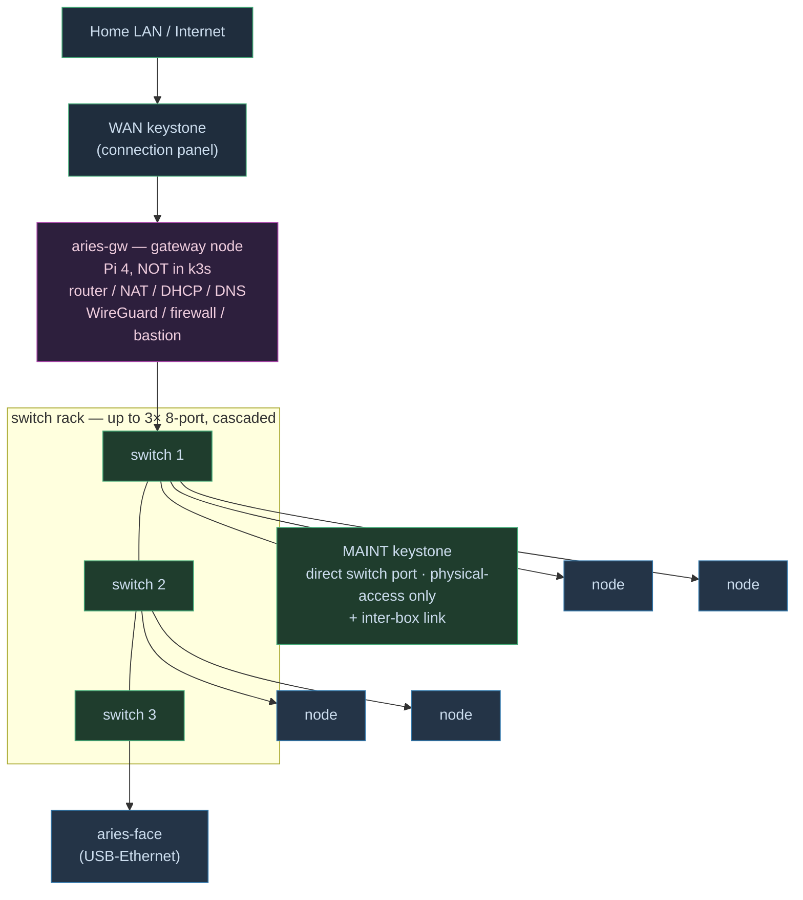

# Aries 28 — Network Design

**Companion to the main design doc. Scope: internal cluster network, WAN uplink, addressing, VLANs, and multi-box scaling.**
Version 1.0 — July 2026

---

## 1. Principles

- **One cable in.** The entire box connects to the outside world through a single Ethernet uplink. Everything inside lives on a private, isolated, **wired-only** network. This makes the box portable (plug it into any network and the internals never change) and self-contained.
- **Wired only, no Wi-Fi inside.** Internal cluster traffic — especially etcd — is latency- and jitter-sensitive; Wi-Fi is neither stable nor appropriate. Every node reaches the internal switch by cable. (The one board without built-in Ethernet, the Pi 3A+ face node, uses a USB-to-Ethernet adapter rather than falling back to Wi-Fi.)
- **Static gateway, reserved control plane, dynamic rest.** The gateway is statically addressed (`.1`) — it routes the subnet and runs DHCP/DNS, so it cannot lease itself. The three k3s **control-plane servers get DHCP reservations** (stable IPs, since embedded etcd and the API-server TLS cert bind to the node IP). Storage, workers, the face node, and transient devices take **dynamic pool addresses** and are identified by their `*.aries.lan` DNS names, not by a fixed IP. No node but the gateway carries a hand-set static address. (See §4.)
- **The cluster is a logical layer above the physical box.** Kubernetes doesn't care which enclosure a node sits in; this is what makes multi-box scaling trivial (see §6).

---

## 2. Topology



All nodes and switches share the `10.28.0.0/24` subnet; switches are cascaded switch-to-switch (one port each as uplink). The cluster is unaware of which switch a node hangs off.

Two Ethernet keystones on the connection panel:
- **WAN** — the single uplink to the home network / internet. Enters the gateway node.
- **MAINT** — a direct port on the internal switch, bypassing the gateway, for debugging and initial setup, and for the inter-box link if a second box is ever added. Physical-access-only (see §8).

---

## 3. The gateway node

`aries-gw` — a Raspberry Pi 4, deliberately **outside** the k3s cluster.

**Hardware — two NICs.** A Pi 4 has one onboard Ethernet port, which isn't enough for a device that sits between two networks. The onboard port serves the internal switch trunk (§5.2 — router-on-a-stick across VLANs 10/20/99); a second, USB3-to-GbE adapter (same part as the face node's, `design-doc.md` §7 BOM) carries the WAN uplink. This is what `dns-and-exposure.md` §6.2 refers to as the gateway's "two network interfaces."

Responsibilities:
- **Router / NAT** between the WAN uplink and the private `10.28.0.0/24` subnet.
- **DHCP** (optional; static reservations) and **DNS** (dnsmasq or Pi-hole) for internal `*.aries.lan` resolution.
- **WireGuard** endpoint — reach the private cloud from anywhere without exposing any internal service directly.
- **Firewall** — the cluster is invisible to the home LAN by default; only what the gateway forwards is reachable.
- Optional: **netboot/TFTP** server (diskless worker boot) and **container registry** host (offline-capable image serving) — added if those capabilities are wanted, not required for basic operation.

**Why outside the cluster:** the gateway is infrastructure the cluster *depends on*, so it must not depend on the cluster. If it were a k3s node, a cluster problem could take out routing and DNS. Keeping it standalone means the network survives the cluster and vice versa. It also means the gateway can host the registry and netboot that the cluster needs *to start* — no chicken-and-egg.

**Do not make the gateway a control-plane node.** Router dies → cluster unreachable is acceptable and recoverable; router *and* etcd dying together is not.

---

## 4. Addressing

- **Subnet:** `10.28.0.0/24` (the "28" on theme). Gateway **static** `.1`; control-plane reservations `.11–.13`; dynamic pool `.100+` for every other node and for transient devices.
- **Static gateway, reserved servers, dynamic agents (IPv4).** The gateway is fixed (`.1`) because it serves DHCP/DNS and routes the subnet. The three control-plane servers get **MAC reservations** so their IPs never move — embedded etcd peer URLs and the API-server TLS SAN are bound to the node IP, and a lease change would break quorum or cert validation. Agents (storage, workers), the face node, and transient devices run **plain dynamic DHCP**: they register to the servers' stable addresses and are reached by their `*.aries.lan` DNS names (dnsmasq registers each lease into DNS automatically), so their own IPs may change freely. See `dns-and-exposure.md` §9.
- **Connect by IP, name by hostname.** k3s names nodes by *hostname* (set per node: `aries-cp-1`, `aries-st-1`, …) but nodes *connect* to each other by *IP*. This avoids a certificate mismatch: the k3s server's TLS certificate covers its IP by default, not arbitrary hostnames, so joining by hostname fails TLS validation unless the certificate is issued with `--tls-san <hostname>`. Agents and servers should join by IP unless a deliberate DNS + TLS-SAN scheme is configured.
- **IPv6:** an optional extension (link-local requires no configuration; ULAs `fd00::/8` provide stable addresses), but k3s IPv6/dual-stack is less widely deployed. IPv4 is the base for a lower-risk bring-up; IPv6 is an optional later addition, not a requirement.

---

## 5. Switching

### 5.1 Switch capacity & expansion
The internal switching lives on the facilities deck in a dedicated **switch rack** — a small rack (or shelf) with **3 bays for up to 3 identical 8-port switches** (TP-Link TL-SG108E). Start with one; cascade a second and third as node count grows. Each cascade link costs one port on *both* ends (design-doc.md §7's two-switch math — 16 ports, 1 link, 14 usable — has this right): chaining three 8-ports (switch 1 — switch 2 — switch 3) is two links, 4 ports lost, so 3× 8-port = 24 − 4 = **20 usable ports**.

- **Why identical switches:** uniformity — same model, same mount, same config approach, interchangeable like the compute carriers. A dead switch is swapped, not re-engineered.
- **Bay standard (custom):** these switches have no off-the-shelf mounting standard (unlike the Decora comms panel), so the switch bay is **fabricated** — a 3D-printed or otherwise-made cradle sized to the TL-SG108E, holding up to three in the rack. This is one of the parts with no off-the-shelf answer, so custom fabrication is warranted (contrast §7.3).
- **Cascade wiring:** switches are chained switch-to-switch internally; all remain on the same `10.28.0.0/24` subnet. The inter-box link (§6) is simply another cascade, into a switch in the other box.

### 5.2 VLANs (managed switch)

The switches are managed (TP-Link TL-SG108E), which buys network lessons and isolation for a few dollars over unmanaged:

- **VLAN 10 — cluster:** the nodes.
- **VLAN 20 — face/kiosk:** the face node / dashboard, optionally isolated.
- **VLAN 99 — MAINT:** the maintenance port.
- Gateway port trunked; router-on-a-stick between VLANs.
- **Port mirroring** to the MAINT port lets a laptop running Wireshark observe live etcd/Longhorn/DNS traffic — a capability an unmanaged switch does not provide, and a useful diagnostic and learning tool.

Note: "Easy Smart"-class managed switches do VLAN tagging but not strict management-plane isolation — fine for the threat model (a private box in a shed), not enterprise-grade segmentation.

---

## 6. Multi-box scaling

*An optional scaling path the architecture supports, extending the containment hierarchy one level up (see the architecture doc). Not required for a single-box deployment.*

When one box isn't enough, a second box is added as **more compute on the same cluster**, not as a second cluster:

- **The second box does NOT need its own control plane.** Its boards join the *existing* cluster (in Box 1) as workers. One logical cluster spans both physical boxes. The control plane in Box 1 schedules pods onto Box 2's nodes exactly as if they were local — Kubernetes has no concept of "box."
- **The boxes connect switch-to-switch, one cable.** Uplink Box 1's internal switch to Box 2's internal switch (a cascade/internal port on each). Both boxes' nodes are then on the same `10.28.0.0/24` subnet; the cluster is unaware of the enclosure boundary. This is the same "cascade a second switch" expansion already planned — the second switch simply lives in another box.
- **Box 2 = powered nodes + one inter-box cable.** Bring it up, join its workers, done. Blast radius: one cable and a set of node-joins. No redesign, no second control plane.

**The one caveat:** with all control-plane nodes in Box 1, Box 1 becomes the single point of failure for both boxes — if Box 1 is powered off, Box 2's workers have no control plane. For a homelab this is acceptable. If independent survival mattered, place one HA control-plane member in Box 2 so etcd quorum survives losing either box — optional insurance, not a requirement.

**Two distinct cables, don't confuse them:**
- **WAN uplink** — gateway ↔ home network. One per *system of boxes*: only the box with the active gateway requires it; a second box's WAN keystone can remain unused or serve as a spare/failover gateway.
- **Inter-box link** — switch ↔ switch, internal. Joins the boxes into one subnet.

### 6.1 Hierarchy note

This is the **fleet** level sitting above **system** in the containment hierarchy (architecture doc §2). A box presents a *switch uplink* as its stable interface; joining boxes is bounded to "one cable + node joins," never a redesign — the same bounded-reconfiguration principle, one level up. Multiple systems → one logical cluster.

---

## 7. Traffic & access — bastion, ingress, and load balancing

The gateway is the **edge** of the system: the single entry point for both administrative access and application traffic. Inside, Kubernetes' own layers take over. There are several distinct paths and several things called "load balancer" — they stack rather than compete.

### 7.1 The gateway's three inbound roles

**Bastion (SSH jump host).** The gateway is the only host reachable from the home LAN (or via WireGuard from elsewhere); internal nodes have no direct route from outside. A node is reached by jumping through the gateway:
```
ssh -J aries-gw aries-cp-1        # ProxyJump: one command, gateway is the hop
```
This provides one hardened, monitored entry point rather than exposing every node. WireGuard extends the same path from outside the local network: a tunnel to the gateway places the client on the internal side, from which any node can be reached.

**Reverse proxy (application traffic).** Separate from SSH: to *use* a hosted service, the gateway forwards HTTP/HTTPS from the WAN side into the cluster (nginx / Traefik / Caddy on the gateway, or a port-forward). It typically forwards to the cluster's ingress rather than load-balancing itself.

**WireGuard (remote access).** The gateway is the VPN endpoint — reach the private cloud from anywhere with zero services exposed directly.

### 7.2 The load-balancing stack (outside-in)

Load balancing occurs at three distinct layers, which stack rather than compete:

| Layer | Component | Balances | Notes |
|---|---|---|---|
| 0 — edge | **Gateway reverse proxy** | traffic into the cluster | usually just forwards to ingress |
| 1 — cluster edge | **Ingress controller** (Traefik, ships with k3s; or ingress-nginx) | across *services* by hostname/path | `nextcloud.aries.lan` → Nextcloud, `grafana.aries.lan` → Grafana |
| 2 — service | **Service / kube-proxy** | across *pods* of one app | always present; this is what spread requests across replicas in the bench tests |

### 7.3 Bare-metal load balancing — MetalLB

In a cloud, a `Service` of `type: LoadBalancer` auto-provisions a cloud load balancer with an external IP. **On bare metal there is no cloud to call, so that type does nothing by default** — the classic homelab surprise.

- **MetalLB** is the standard solution: a bare-metal load-balancer implementation that allocates real IPs from a pool on the subnet (a slice of `10.28.0.x`) and answers ARP for them, so `type: LoadBalancer` behaves as it does in a cloud environment. Recommended where cloud-equivalent behavior is desired.
- **Or skip it:** use `NodePort` (as in the bench cluster) or point the gateway's reverse proxy straight at the ingress on a known node/port. Simpler, less "cloud-like," fine for a small setup.

### 7.4 Clarification — the face node is NOT the ingress

The **face node** (Pi 3A+) is the LED/display driver, **outside the cluster and outside the traffic path**. It does not route or balance application traffic. The "cluster entry point / load balancer" role belongs to the **gateway** (external edge) and the **ingress controller** (in-cluster, runs as pods on normal nodes). If a dedicated "ingress node" is ever wanted, that is a regular cluster node labeled to run the ingress controller — not the face node. Don't conflate lights/dashboard (face) with traffic routing (ingress).

### 7.5 Mental model

```
SSH   → gateway (bastion)        → ssh -J to any node
App   → gateway (reverse proxy)  → ingress → Service → pods
             [ optional: MetalLB gives type:LoadBalancer real IPs ]
Remote      → WireGuard → gateway       → as if inside
```

Gateway = edge (bastion + reverse proxy + VPN). Ingress + MetalLB = the cloud-load-balancer equivalent. kube-proxy/Service = the always-present per-app pod balancer.

---

## 8. Connection panel (external-facing I/O)

The single external face for power and comms. Designed on the same principle as the rest of the machine: **fixed structure, swappable inserts, prefer an existing modular standard over a custom one.**

### 8.1 Fixed components (permanent cuts)
- **IEC C14 power inlet** with integrated switch + fuse — the single AC entry. Never changes.
- **Power button** — soft-power / service button, **recessed** (so a curious finger or a bump can't trigger a force-off). Fixed location.
- **Decora opening** — one standard rectangular cutout for all comms (see below).

### 8.2 Comms: Decora + keystones (off-the-shelf, not custom-printed)
Rather than cut every possible port permanently, or design/print custom sub-panels, the panel uses a **standard Decora wall-plate opening** populated with **keystone inserts**. This is a mature, commodity modular standard: RJ45, USB, HDMI, coax, fiber couplers, and blanks all snap into the same opening.

- **Why Decora over printed sub-panels:** it's a solved problem — no CAD, no tolerance tuning, no test-fit reprints; jacks are made to the plate spec and snap in first time; it looks like finished infrastructure rather than a fabricated part; it's cheap and available anywhere. Using an existing standard is better engineering than reinventing one — the same judgment as buying the PSU and extrusion instead of fabricating them.
- **The only thing fabricated is the acrylic cutout**, cut to the published Decora opening dimensions — a spec to follow, not a design to invent, achievable with any cutting method.

**Primary box population:**
- **WAN** — RJ45 keystone → gateway uplink.
- **MAINT / expansion** — RJ45 keystone → direct switch port. Serves both maintenance and the inter-box link if a second box is ever added.
- **USB console** (optional) — keystone → gateway serial.
- **Blanks** — fill unused keystone slots (reads as "expansion slot," server-style).

Adding the inter-box link later = pop a blank, snap in an RJ45. No re-cut, no reprint.

### 8.3 Design principle — prefer an existing standard
Where a good modular standard already exists (Decora/keystone for I/O), use it instead of inventing a custom equivalent. It's less work, more reliable, and more serviceable — and it's consistent with the project's "stable interface, swappable insert" philosophy, just satisfied off the shelf. Reserve custom fabrication for the parts that have no off-the-shelf answer (carriers, rack, enclosure).

---

## 9. Cabling (physical)

- Internal runs are wired to the switch(es) on the facilities deck; nodes drop patch cables from their bays.
- **Per-cable adjustable slack:** each node's Ethernet cable has individually adjustable slack parked as a hidden service loop, so swapping a board type (whose jack position differs) is absorbed by adjusting one cable — no re-running, no harness rebuild. 3D-printed cable-holder braces keep parallel runs tidy *and* park the service loops.
- Keep internal patch runs short; label both ends.

---

## 10. Security posture

- Cluster is **not exposed** to the home LAN by default — the gateway firewalls it; only forwarded services or the WireGuard tunnel reach in.
- **MAINT port is physical-access-only.** It grants direct switch access, but only to someone who can physically reach the box — and physical access already trumps any network control (they could open the panel, or just walk off with the whole tower). So MAINT is not an additional hole. Optionally disable the port on the managed switch except when servicing, closing even that vector in normal operation. **Critically, MAINT must NOT be a second uplink bridging the cluster to the home LAN** — that would defeat the gateway's isolation. It is a switch port for a physically-present laptop (and the inter-box link), nothing more.
- **k3s join token is a credential** — anyone with the token and access to port 6443 can join a node. Low risk on an isolated shed subnet; treat it as a password once the cluster is reachable beyond the box (WireGuard/port-forward). Consider a separate, lower-privilege **agent token** for workers so a compromised worker can't bootstrap a control-plane node.
- Node-to-node traffic is **mutually TLS-authenticated** (k3s issues per-node client certs during join, bootstrapped by the token) — encrypted even on the internal wire.

---

## Related documentation

- `docs/architecture.md` — the containment hierarchy this network plugs into (fleet → system → deck → rack → bay).
- `docs/design-doc.md` — connection panel, VLAN plan origin, gateway in the fleet.
- `docs/node-setup.md` — the k3s join procedure and the IP-not-hostname / TLS-SAN behavior in practice.
